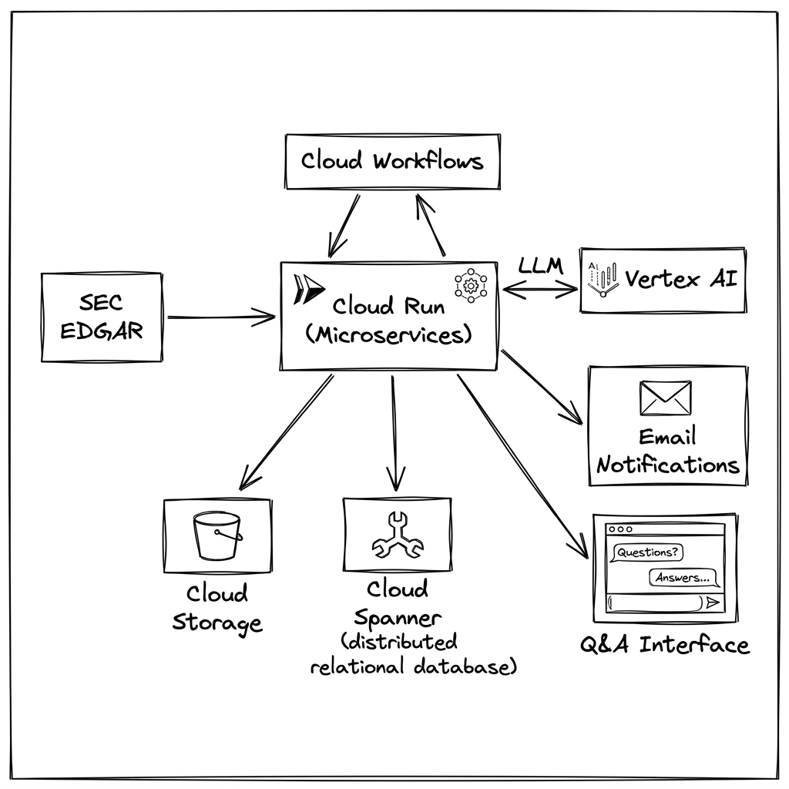
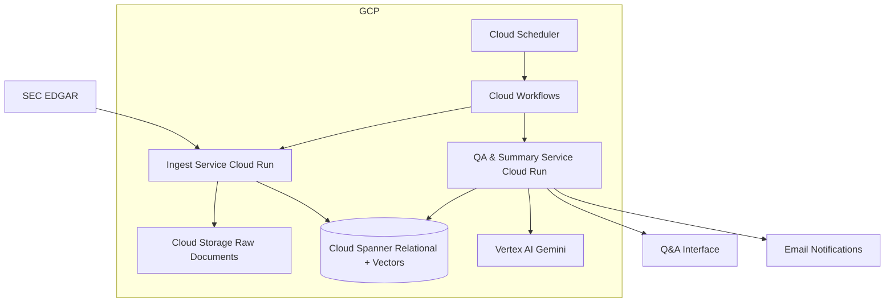

# Company Filing Pipeline (RAG)

An automated pipeline for ingesting, processing, and analyzing company filings from the SEC EDGAR system using a Retrieval-Augmented Generation (RAG) architecture on Google Cloud.

## 🚀 Overview

This application automates the process of monitoring public companies for new SEC filings (like 8-K, 10-Q, and 10-K). It downloads these filings, processes the text, generates vector embeddings for semantic search, and provides a RAG-based interface to ask questions or generate automated summaries. It includes a daily email notification system to keep users informed of new developments.

## ✨ Features

*   **Automated SEC Ingestion**: Regularly polls the SEC for new filings for a configured list of active companies.
*   **Intelligent Chunking**: Extracts primary text from complex filing documents and splits it into manageable chunks for analysis.
*   **Vector Search Ready**: Generates and stores text embeddings in **Cloud Spanner** for efficient semantic search.
*   **RAG-based Q&A**: Allows users to ask specific questions about filing contents with citations back to the source text.
*   **Daily/Weekly Summaries**: Automatically generates summaries focused on market impact and sends them via email.
*   **"No News" Notifications**: Sends a heartbeat email even when no new filings are found, so you know the system is working.
*   **Fully Serverless Orchestration**: Managed via **Google Cloud Workflows** and scheduled with **Cloud Scheduler**.

## 📐 Architecture

### Visual Overview

### Component Diagram (Mermaid)

## 🛠️ Tech Stack

*   **Database**: Google Cloud Spanner (relational storage + vector search).
*   **Storage**: Google Cloud Storage (GCS) for raw document archiving.
*   **Compute**: Cloud Run (Python / Flask microservices).
*   **AI/ML**: Vertex AI (Gemini models) for embeddings and text generation.
*   **Orchestration**: Google Cloud Workflows.
